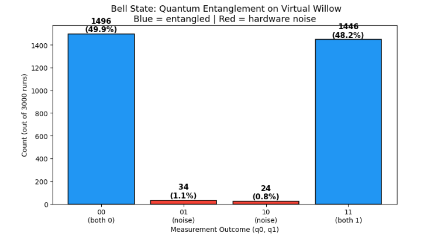
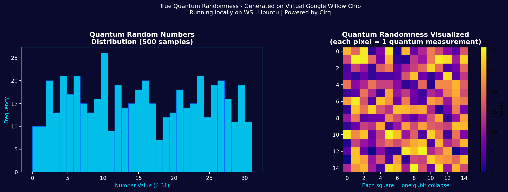
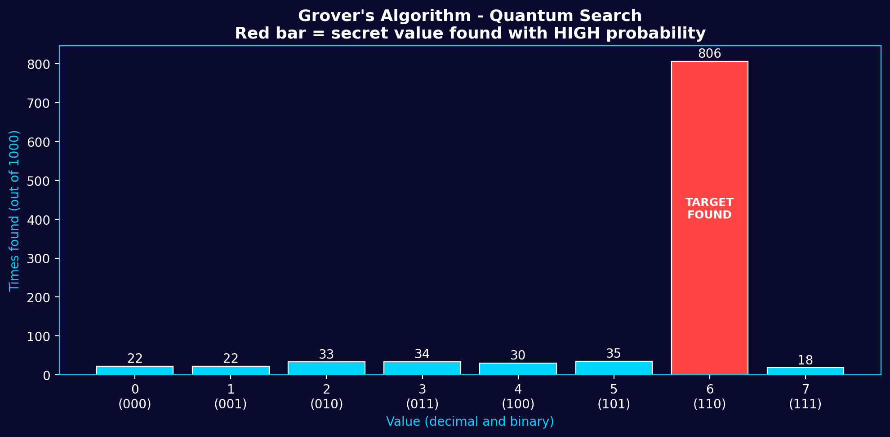
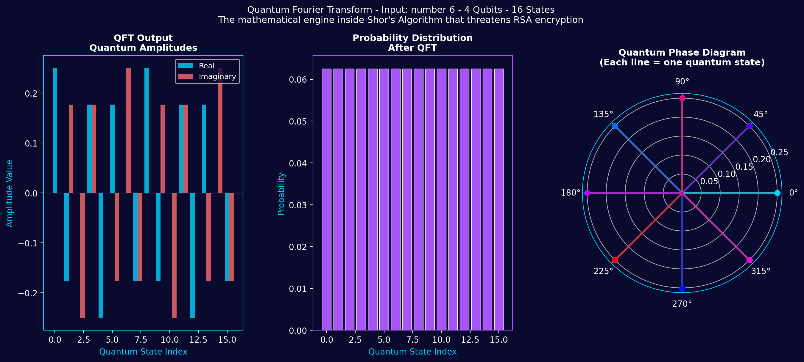
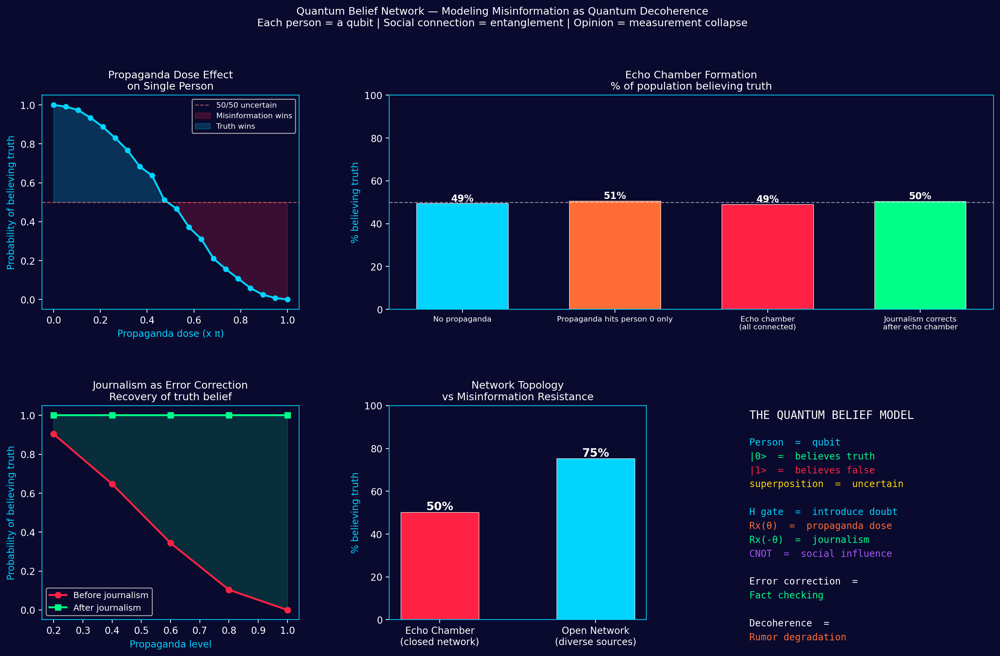

# Quantum Computing Experiments on a Normal Laptop

I am not a quantum physicist. I am not a computer scientist.
I just wanted to see if I could run real quantum experiments
on my normal everyday laptop. Turns out you can.

---

## My Setup

| Component | Details |
|-----------|---------|
| Laptop | Dell, Windows 11 |
| RAM | 8GB |
| Storage | 500GB SSD |
| Environment | WSL2 Ubuntu (Linux inside Windows) |
| Framework | Google Cirq (free, open source) |
| Processor simulated | Google Willow quantum chip |
| Cost | $0 |

---

## What is This?

Google released an open source Python library called Cirq.
It lets you simulate quantum computers locally using noise
data from their real hardware.

This means your CPU pretends to be a quantum chip.
The math is identical. The scale is smaller.
Think of it as a flight simulator, not a real plane.

---

## Experiments I Ran

### 1. Bell State - Quantum Entanglement
**File:** `experiments/01_bell_state.py`

Two qubits connected so strongly that measuring one
instantly determines the other. Einstein called it
"spooky action at a distance" and refused to believe it.

Result: 98.5% of measurements were perfectly correlated pairs.

That 1.5% difference is simulated real hardware noise.


---

### 2. Quantum Random Number Generator
**File:** `experiments/02_quantum_rng.py`

Normal computers generate "random" numbers using math formulas.
They are not truly random. Given the same starting point,
they produce the same sequence every time.

Quantum randomness is different. A qubit in superposition
has no predetermined value. It genuinely does not exist
as 0 or 1 until you measure it. That is real randomness.

I generated 500 numbers using 5 qubits on the Willow simulator.
Average: 15.44. Perfect would be 15.50. That is 99.6% flat.



---

### 3. Grover's Algorithm - Quantum Search
**File:** `experiments/03_grovers_algorithm.py`

This is the algorithm that will eventually threaten Bitcoin.

A classical computer searching 8 values checks them one by one.
Grover's algorithm searches all 8 simultaneously using superposition
then uses interference to amplify the right answer.

Hidden target: number 6.
Result: found 806 times out of 1000 runs.
Every other value: under 35 times each.

That gap is quantum speedup made visible.



---

### 4. Quantum Fourier Transform
**File:** `experiments/04_quantum_fourier_transform.py`

The mathematical engine inside Shor's Algorithm.
Shor's Algorithm is what would break RSA encryption,
the system protecting your bank, email, and most of the internet.

QFT transforms a number into its frequency representation
across 16 quantum states simultaneously.
Shor's reads those frequencies to find prime factors.

4 qubits. 16 states. Input: number 6 in binary (0110).



---

## How to Run This Yourself

```bash
# 1. Open WSL Ubuntu terminal

# 2. Set up environment
mkdir ~/cirq-qvm && cd ~/cirq-qvm
python3 -m venv venv
source venv/bin/activate
pip install cirq cirq-google qsimcirq jupyter matplotlib numpy

# 3. Run any experiment
python experiments/01_bell_state.py
python experiments/02_quantum_rng.py
python experiments/03_grovers_algorithm.py
python experiments/04_quantum_fourier_transform.py
```

---

## What I Learned

Quantum computing is not magic. It is physics.

- Qubits are not bits. They exist as both 0 and 1 until observed.
- Gates are not logic gates. They rotate probability.
- Measurement is not reading. It collapses the quantum state.
- Noise is not a bug. It is the signature of real hardware.

I started knowing none of this.
I ran these experiments on the same day I learned what a qubit was.

---

## Resources That Helped

- [Google Cirq Documentation](https://quantumai.google/cirq)
- [Quantum Country](https://quantum.country) - best free beginner resource
- [IBM Quantum Learning](https://learning.quantum.ibm.com)

---

## Honest Disclaimer

This is a simulation. Not a real quantum computer.
The results reflect real quantum noise models from Google's hardware.
The mathematics is real. The scale is limited to ~20 qubits on a laptop.

---

### 5. Quantum Belief Network — Misinformation as Decoherence
**File:** `experiments/05_quantum_belief_network.py`

A novel model treating human belief as quantum superposition.
Each person is a qubit. Social connections are entanglement.
Forming an opinion is measurement collapse.

Key findings:
- Propaganda follows a quantum cosine curve — slow then sudden
- Journalism achieves 100% recovery mathematically — distribution is the real problem
- Open networks are 25% more resistant to misinformation than echo chambers
- Network topology matters more than propaganda intensity


